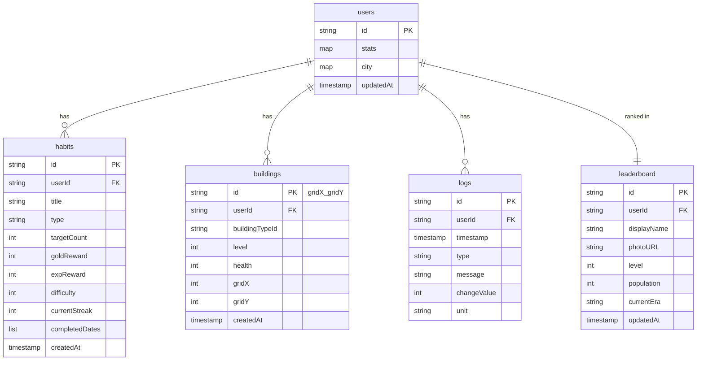

# Habitoria

Habitoria is a gamified habit-tracking application where users build and grow a civilization through consistent real-life habit completion.

---

## Overview

Habitoria fuses a **habit tracker** with a **city-builder civilization simulator**. Every habit you complete in real life fuels the growth of your in-game civilization.

**Progression System**
Players earn EXP from habit completion, level up through an exponential scaling curve, and unlock new eras as their city population grows. Each era opens access to new buildings, evolution branches, and strategic options.

**Resource Management**
Two currencies — Gold (earned from habits, spent on recovery and gacha) and Silver (generated by city taxes, spent on construction) — create a dual-economy loop. City resources like Food, Housing, Health, and Happiness must be balanced to sustain population growth and survive random disaster events.

---

## Core Features

### Habit System
- **Habit Creation** — Create habits with automatic reward scaling based on frequency type
- **Daily / Weekly / Monthly** — Three habit cadences with period-based completion tracking
- **Streak Tracking** — Consecutive completion counter per habit; streaks reset on missed dailies at End Day
- **Overachievement Mode** — Completing beyond target count yields 50% reduced rewards

### Reward & Economy
- **Gold** — Personal currency from habits, used for recovery items, gacha, and currency conversion
- **Silver** — City currency from daily tax, used for building placement and upgrades
- **Momentum** — 0–100 multiplier that scales habit rewards up to 1.5x at maximum

### Progression
- **EXP System** — Accumulated from habit completion; base values: 50 (daily), 250 (weekly), 1000 (monthly)
- **Leveling System** — Level up when EXP exceeds `maxExp`; each level increases next threshold by 20%
- **HP System** — Personal health points; gained on good days, lost on bad days; capped at `maxHp`
- **Era Progression** — 5 eras unlocked by population milestones: Stone Age → Medieval → Industrial → Modern → Digital

### City Management
- **City Population** — Grows when food, housing, and health conditions are met; shrinks from sickness and death
- **Building Placement** — 10×10 grid system; buildings placed by `gridX`/`gridY` coordinates
- **Building Upgrades** — Each level grants +20% output multiplier on building stats
- **Population Sickness** — Sick citizens don't produce tax; recovery depends on city health

### Random Events
- **Disasters** — 15% chance per End Day: Plague (health), Earthquake (building), Drought (happiness), Unrest (happiness)
- **Emergency Habits** — Disasters automatically spawn mitigation habits

### Reporting & Social
- **Pending Reports** — Daily summary generated at End Day showing all gains, losses, and events
- **Leaderboard** — Global ranking by level (primary) and population (secondary); top 20 displayed

### Evolution Branches
Seven civilization paths that grant permanent passive bonuses:
- **Nomadic** — Construction cost −10%
- **Agrarian** — Food production +20%, Health +5%
- **Feudal** — Tax income +15%
- **Mercantile** — Silver income +100 base
- **Industrialist** — Construction cost −20%, Food +30%
- **Modernist** — Happiness +15
- **Cybernetic** — Health +50

---

## Game Loop

```
┌─────────────────────────────────────────────┐
│  1. Complete Habits                         │
│     → Gain Gold + EXP + Momentum            │
│                                             │
│  2. Gain Rewards                            │
│     → Level up, unlock eras & evolutions    │
│                                             │
│  3. Improve City                            │
│     → Build, upgrade, manage resources      │
│                                             │
│  4. End Day                                 │
│     → Process tax, growth, sickness         │
│     → Survive random disaster events        │
│                                             │
│  5. Progress Civilization                   │
│     → Era advancement, population growth    │
│     → Leaderboard update                    │
└─────────────────────────────────────────────┘
```

Short loop:
1. **Complete habits** → earn Gold and EXP
2. **Gain rewards** → accumulate Momentum for multiplier scaling
3. **Improve city** → spend Silver on buildings and upgrades
4. **Survive events** → manage HP, health, and happiness through End Day
5. **Progress civilization** → reach population targets to advance eras

---

## Tech Stack

| Layer | Technology |
|-------|-----------|
| Frontend | React 19, Vite 6, Tailwind CSS 4, Framer Motion 12 |
| Backend | Firebase (serverless) |
| Database | Cloud Firestore (real-time sync) |
| Auth | Firebase Auth (Google Sign-In) |
| Hosting | Firebase Hosting / Vercel |
| PWA | vite-plugin-pwa (offline-capable, installable) |
| AI | Google Gemini API (`@google/genai`) |
| Icons | Lucide React |

---

## Database Structure



**`users` document** contains two embedded maps:
- `stats` — hp, maxHp, gold, silver, exp, level, maxExp, momentum, dayCount, skipTickets, badges, unlockedEras, pendingReport, lastEndDay, lastCelebratedLevel
- `city` — population, populationSick, food, housing, health, happiness, buildings[], currentEra, unlockedEvolutions[]

---

## Folder Structure

```
src/
├── components/
│   ├── Header.tsx            # Top stats bar (HP, Gold, Level, Day)
│   ├── Navigation.tsx        # Bottom tab navigation
│   ├── RealitaTab.tsx        # Habit list, completion, End Day trigger
│   ├── KotaTab.tsx           # City grid, building placement/upgrade
│   ├── TokoTab.tsx           # Shop: recovery items, gacha, currency exchange
│   ├── MenuTab.tsx           # Settings, activity logs
│   ├── EvolutionTab.tsx      # Evolution branch tree
│   ├── LeaderboardTab.tsx    # Global rankings
│   ├── DailyReportOverlay.tsx# End Day summary overlay
│   └── LoginScreen.tsx       # Google Sign-In prompt
├── hooks/
│   ├── useCivStore.ts        # Central state management + Firestore sync
│   ├── useThemeStore.ts      # Theme state
│   └── useOnlineStatus.ts    # Network connectivity detection
├── lib/
│   ├── firebase.ts           # Firebase app initialization + auth
│   ├── firestoreUtils.ts     # Error handling utilities
│   ├── cityUtils.ts          # City summary calculation engine
│   └── validation.ts         # Data normalization + validation layer
├── types.ts                  # TypeScript interfaces and enums
├── constants.ts              # Game config: eras, buildings, disasters, evolution branches
├── App.tsx                   # Root component, tab routing, overlays
└── main.tsx                  # Entry point
```

---

## Installation

### Prerequisites
- Node.js ≥ 18
- A Firebase project with Firestore and Google Auth enabled

### Setup

```bash
# Clone the repository
git clone <repository-url>
cd habit-tracker

# Install dependencies
npm install

# Configure environment
cp .env.example .env
# Edit .env and add your GEMINI_API_KEY if using AI features

# Ensure firebase-applet-config.json contains your Firebase project config
# Required fields: apiKey, authDomain, projectId, firestoreDatabaseId

# Start development server
npm run dev

# Production build
npm run build
```

### Firebase Setup
1. Create a Firebase project at [console.firebase.google.com](https://console.firebase.google.com)
2. Enable **Google Sign-In** under Authentication → Sign-in method
3. Create a **Firestore** database
4. Deploy `firestore.rules` to enforce security rules
5. Copy your Firebase config into `firebase-applet-config.json`

---

## Development Notes

### Firestore Collections as Source of Truth
All game state is persisted to Firestore under each user's document tree:
- `/users/{uid}` — main document containing `stats` and `city` maps
- `/users/{uid}/habits/{habitId}` — individual habit documents
- `/users/{uid}/buildings/{gridX}_{gridY}` — building documents with coordinate-based IDs
- `/users/{uid}/logs/{logId}` — immutable activity log entries
- `/leaderboard/{uid}` — public ranking document per user

### Logs are Immutable Audit Trail
The `/logs` subcollection enforces create-only access in Firestore security rules (`allow update, delete: if false`). Logs serve as a transparent, append-only history of all game actions.

### Buildings Use Coordinate-Based IDs
Building documents use deterministic IDs in the format `{gridX}_{gridY}` (e.g., `3_7`). This matches the mobile client schema, prevents duplicate tile placement, and enables efficient coordinate lookups. Legacy random-ID documents are automatically migrated on read without deletion.

### Validation Layer
All Firestore writes are validated before execution via `src/lib/validation.ts`. This includes:
- Era enum normalization (handles legacy formats like "Stone Age", "STONE AGE")
- Habit type validation (`daily` | `weekly` | `monthly`)
- Building payload schema validation
- Log payload schema validation

Validation failures log warnings and skip the write — they never throw.

### Dual-Write Pattern
Buildings are persisted in both `city.buildings[]` (embedded in the user document) and the `/buildings` subcollection. The subcollection is the canonical source for cross-platform compatibility with mobile clients.
